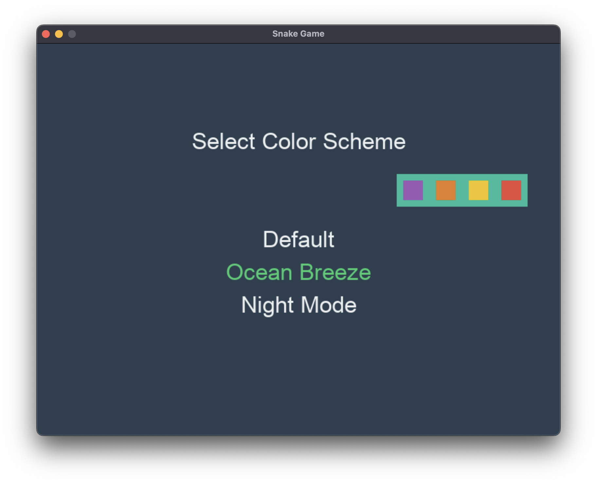

# Snake-game

This is a simple snake game built with Python.

## Features

- Classic snake game mechanics
- Score tracking
- Game over screen

## Controls

- Use the arrow keys to move the snake
- The snake will grow longer as it eats food
- The game will end when the snake hits the edge of the screen or the snake itself
- Press 'SPACE' to pause the game

## Menu Controls

- Up and down arrow keys to select the colors and speed.
- Press enter to select the colors, speed, and start the game.
-Color Previews are on the side.




To add this image to your README:

1. Take a screenshot of your game in action.
2. Save the screenshot as "snake_game_preview.png" in the same directory as your README.md file.
3. Make sure the image file is committed and pushed to your GitHub repository along with the other game files.

The image will now appear in your README on GitHub, providing visitors with a visual preview of your Snake game.


## How to Download and Run the Game

Follow these steps to download and run the Snake game:

1. Open your terminal or command prompt.

2. Navigate to the directory where you want to download the game. For example:
   - On Windows:
     ```
     cd C:\Users\YourUsername\Documents
     ```
   - On macOS or Linux:
     ```
     cd ~/Documents
     ```
   Replace 'YourUsername' with your actual username and adjust the path as needed.

3. Clone the repository by running the following command:
   ```
   git clone https://github.com/ARI-100/Snake-game.git
   ```

4. Change into the game directory:
   ```
   cd Snake-game
   ```

5. Ensure you have Python installed on your system. This game requires Python 3.12.6 or higher.

6. Install the required dependencies:
   ```
   pip install pygame
   ```
   Note: The 'random' module is part of Python's standard library, so you don't need to install it separately.

7. Run the game:
   ```
   python stuffy.py
   ```

Now you should see the game window open, and you can start playing the Snake game!


